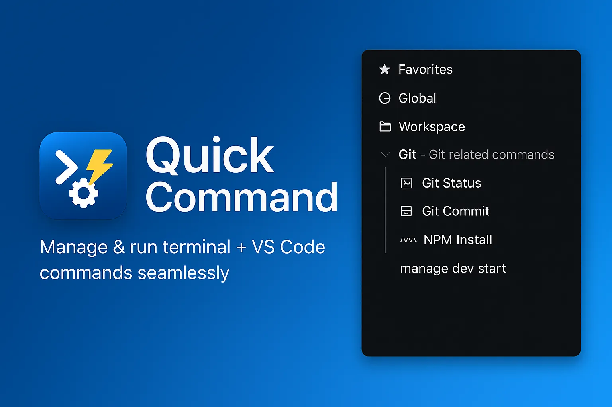
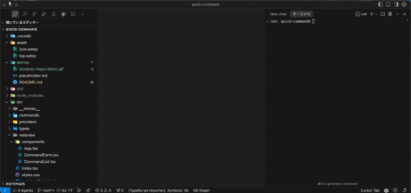

# Quick Execute Commands



[](https://marketplace.visualstudio.com/items?itemName=ren-mntn.quick-exec-commands)
[](https://marketplace.visualstudio.com/items?itemName=ren-mntn.quick-exec-commands)
[](https://marketplace.visualstudio.com/items?itemName=ren-mntn.quick-exec-commands)

## 🚀 **ショートカットキーの悩み、もう終わり！**

**たった 1 つのショートカット** `Ctrl+Alt+Q` だけ覚えれば、あなたのすべてのコマンドにアクセス可能！

---

## ✨ **3 つの魅力で作業効率が劇的 UP**

### 🗂️ **1. ネスト構造で整理整頓**

```
📁 開発環境
  ├── 📁 Git操作
  │   ├── 🖥️ git status
  │   └── 🖥️ git commit -m [メッセージ]
  ├── 📁 Docker
  │   └── 🖥️ docker-compose up
  └── ⚙️ VS Code: ターミナルを開く
```

**もうコマンドを探し回る必要なし！** フォルダ分けして、すっきり管理

---

### ⚡ **2. ターミナル + VS Code、両方対応**

| **ターミナルコマンド** | **VS Code コマンド** |
| ---------------------- | -------------------- |
| `npm start`            | ファイル保存         |
| `git push`             | サイドバー切り替え   |
| `docker build`         | コマンドパレット表示 |

**1 つの拡張機能で、すべて完結！**

---

### 🎯 **3. 動的入力で柔軟性抜群**


_↑ コマンドに `[変数名]` を入れると、実行時に入力フォームが表示！_

```bash
git commit -m "[コミットメッセージ]"
docker run --name [コンテナ名] [イメージ名]
```

**決まりきったコマンドも、カスタマイズ可能なコマンドも、これ 1 つで！**

---

## 📱 **直感的な 2 つのインターフェース**

### **🌟 メインパネル（サイドバー）**


_整理されたコマンド一覧で、マウスクリックで実行_

### **⚡ クイックアクセス（ショートカット）**


_`Ctrl+Alt+Q` でコマンドパレット風に即アクセス_

---

## 🎊 **こんな人におすすめ！**

- ✅ **「あのコマンド何だっけ？」** が口癖の人
- ✅ **ショートカットキーが覚えられない** 人
- ✅ **プロジェクトごとにコマンドが違って** 混乱する人
- ✅ **作業を効率化したい** すべての開発者

---

## 🚀 **5 分で使い始められる！**

### 📥 **簡単インストール**

**方法 1: VS Code 内でインストール**

1. `Ctrl+Alt+Q` で拡張機能パネルを開く
2. "Quick Execute Commands" で検索
3. 「インストール」をクリック

**方法 2: Marketplace からインストール**
[](https://marketplace.visualstudio.com/items?itemName=ren-mntn.quick-exec-commands)

### ⚡ **クイックスタート**

1. **起動** → `Ctrl+Alt+Q` でコマンド一覧表示
2. **登録** → 「➕ コマンド追加」でよく使うコマンドを追加
3. **実行** → コマンドを選択するだけ！

**今すぐ試して、作業効率の劇的変化を体験してください！**

---

# 詳細機能

VS Code でコマンドを効率的に管理・実行するための拡張機能です。**ターミナルコマンド**と **VS Code 内部コマンド**の両方をサポートし、統一されたインターフェースで管理できます。

## 🌟 主な特徴

- **🖥️ ターミナルコマンド**: npm, git, docker などの一般的なコマンド
- **⚙️ VS Code コマンド**: ファイル保存、設定画面、拡張機能など VS Code 内部の操作
- **🎯 インテリジェント登録**: コマンドタイプに応じた最適化された UI
- **📁 階層管理**: ディレクトリ構造でコマンドを整理
- **🔍 高度な検索**: 名前、説明、タグによる柔軟な検索
- **📊 実行履歴**: コマンド使用頻度と履歴の追跡

## 🚀 新機能 (最新版)

### VS Code コマンドサポート

- **利用可能なコマンド**をリストから選択
- **人気コマンド**（⭐ マーク）の優先表示
- **リアルタイム検索**による素早いアクセス
- **日本語表示名**の自動提案

### 改善されたコマンド登録 UX

- **2 ステップ式**の直感的なフロー
- コマンドタイプの事前選択
- VS Code コマンドの検索可能リスト
- ターミナルコマンドの従来式入力

### コマンド編集機能

- 既存コマンドの完全編集
- TreeView と Webview の両方から編集可能
- コマンドタイプの変更も可能

## 📋 使い方

### 基本操作

1. **コマンドパレット**から `Quick Execute Commands: パネルを表示` を実行
2. **サイドバー**の Quick Execute Commands パネルを使用
3. **ショートカットキー**:
   - `Ctrl+Shift+X` (Windows/Linux) または `Ctrl+Alt+Q` (Mac) - コマンドリスト表示
   - `Ctrl+Shift+F` (Windows/Linux) または `Cmd+Shift+F` (Mac) - コマンド検索

### コマンド登録（新しい UX）

#### 🖥️ ターミナルコマンドを追加

```
1. 「新しいコマンドを追加」をクリック
2. 「ターミナルコマンド」を選択
3. コマンド名を入力（例: "Git Status"）
4. コマンドを入力（例: "git status"）
5. 説明、保存範囲、お気に入りを設定
```

#### ⚙️ VS Code コマンドを追加

```
1. 「新しいコマンドを追加」をクリック
2. 「VS Codeコマンド」を選択
3. コマンドリストから検索・選択
   - 人気コマンド（⭐）が上位表示
   - 検索ボックスでフィルタリング
4. 表示名と説明を入力（自動提案あり）
5. 保存範囲とお気に入りを設定
```

### 人気の VS Code コマンド例

| コマンド                                   | 表示名                   | 用途                             |
| ------------------------------------------ | ------------------------ | -------------------------------- |
| `workbench.action.files.save`              | ファイルを保存           | 現在のファイルを保存             |
| `workbench.action.files.saveAll`           | 全ファイルを保存         | 開いているすべてのファイルを保存 |
| `workbench.action.quickOpen`               | クイックオープン         | ファイル検索ダイアログを開く     |
| `workbench.action.showCommands`            | コマンドパレット         | コマンドパレットを表示           |
| `workbench.action.toggleSidebarVisibility` | サイドバー切り替え       | サイドバーの表示/非表示          |
| `editor.action.formatDocument`             | ドキュメントフォーマット | コードフォーマットを実行         |
| `workbench.action.reloadWindow`            | ウィンドウリロード       | VS Code ウィンドウを再読み込み   |

### 階層ナビゲーション

ショートカットキー実行時の階層的なナビゲーション：

```
1. カテゴリ選択
   ⭐ Favorites
   🌐 Global
   📁 Workspace

2. ディレクトリ・コマンド選択
   📂 .. (Back)
   📁 aws/
   📁 docker/
   🖥️ Git Commit
   ⚙️ ファイルを保存 [VS Code]

3. サブディレクトリナビゲーション
   📂 .. (Back)
   📁 ec2/
   📁 s3/
   🖥️ AWS CLI Setup
```

### ディレクトリ管理

```
📁 workspace
  ├── 📁 development
  │   ├── 🖥️ npm start
  │   ├── 🖥️ npm test
  │   └── ⚙️ ターミナルを開く [VS Code]
  ├── 📁 git
  │   ├── 🖥️ git status
  │   ├── 🖥️ git commit -m [message]
  │   └── ⚙️ ソース管理を表示 [VS Code]
  └── 📁 docker
      ├── 🖥️ docker build -t myapp .
      └── 🖥️ docker run --rm myapp

📁 global
  ├── 📁 vscode-commands
  │   ├── ⚙️ 設定を開く [VS Code]
  │   ├── ⚙️ 拡張機能を表示 [VS Code]
  │   └── ⚙️ コマンドパレット [VS Code]
  └── 📁 system
      ├── 🖥️ node --version
      └── 🖥️ npm --version
```

### コマンド編集

**TreeView から編集**:

```
1. コマンドを右クリック
2. 「コマンドを編集」を選択
3. フォームで編集（コマンドタイプも変更可能）
```

**Webview から編集**:

```
1. コマンドの ✏️ ボタンをクリック
2. 編集フォームで修正
3. 「更新」をクリック
```

### 動的入力フィールド

コマンドに `[変数名]` を含めると、実行時に入力フォームが表示されます：

```bash
# ターミナルコマンドの例
git commit -m "[コミットメッセージ]"
docker run --name [コンテナ名] [イメージ名]
npm install [パッケージ名]

# VS Codeコマンドでは引数として処理
```

## 🎮 操作方法

### TreeView の操作

- **➕ アイコン**: 新しいコマンドを追加
- **📁 アイコン**: 新しいディレクトリを追加
- **🔍 アイコン**: コマンド検索
- **⭐ アイコン**: お気に入り切り替え
- **✏️ アイコン**: コマンド編集
- **🗑️ アイコン**: コマンド削除
- **右クリック**: コンテキストメニューで詳細操作

### Webview の操作

- **コマンドカード**: クリックで実行
- **⭐ ボタン**: お気に入り切り替え
- **▶️ ボタン**: コマンド実行
- **✏️ ボタン**: コマンド編集
- **🗑️ ボタン**: コマンド削除

## 🔧 高度な機能

### 検索機能

```
1. コマンドパレット → "Quick Execute Commands: コマンド検索"
2. キーワードを入力（名前、説明、タグで検索）
3. 結果から実行したいコマンドを選択
```

### エクスポート/インポート

```
エクスポート:
1. カテゴリを右クリック → 「エクスポート」
2. 保存場所を選択

インポート:
1. カテゴリを右クリック → 「インポート」
2. JSONファイルを選択
```

### 実行履歴

```
1. コマンドパレット → "Quick Execute Commands: 実行履歴表示"
2. 過去の実行履歴から再実行（最大100件）
```

## 📊 コマンド一覧

| コマンド                                   | 説明                   | ショートカット |
| ------------------------------------------ | ---------------------- | -------------- |
| `quick-exec-commands.showPanel`            | パネルを表示           | -              |
| `quick-exec-commands.showCommandList`      | コマンドリストを表示   | `Ctrl+Shift+K` |
| `quick-exec-commands.searchCommands`       | コマンドを検索         | `Ctrl+Shift+F` |
| `quick-exec-commands.addCommand`           | コマンドを追加         | -              |
| `quick-exec-commands.editCommand`          | コマンドを編集         | -              |
| `quick-exec-commands.addDirectory`         | ディレクトリを追加     | -              |
| `quick-exec-commands.showHistory`          | 実行履歴を表示         | -              |
| `quick-exec-commands.exportCommands`       | コマンドをエクスポート | -              |
| `quick-exec-commands.importCommands`       | コマンドをインポート   | -              |
| `quick-exec-commands.createSampleCommands` | サンプルコマンドを作成 | -              |

## ⚙️ データ保存

- **グローバルコマンド**: VS Code のグローバル設定に保存
- **ワークスペースコマンド**: 各ワークスペースの設定に保存
- **実行履歴**: グローバル設定に保存（最大 100 件）
- **ディレクトリ構造**: コマンドと同じ範囲で保存

## 🛠️ 開発

### 必要な環境

- Node.js 16+
- npm

### セットアップ

```bash
# 依存関係のインストール
npm install

# ビルド
npm run build

# テスト実行
npm test

# 開発モード（ファイル監視）
npm run dev
```

### テスト

```bash
# 全テスト実行
npm test

# 統合テスト
npm test -- --testNamePattern="integration"
```

## 📝 変更履歴

### v0.0.4 (2024-XX-XX) - 🎯 VS Code コマンドサポート

- ✨ **VS Code コマンドサポート**: 内部コマンドの実行に対応
- ✨ **改善されたコマンド登録 UX**: 2 ステップ式の直感的なフロー
- ✨ **VS Code コマンドリスト**: 利用可能なコマンドから検索・選択
- ✨ **コマンド編集機能**: 既存コマンドの完全編集
- ✨ **人気コマンド表示**: よく使われるコマンドを優先表示
- ✨ **日本語表示名**: VS Code コマンドの自動日本語化
- 🎨 **UI 改善**: コマンドタイプ別のバッジ表示
- 🔧 **引数サポート**: VS Code コマンドの引数自動解析

### v0.0.3 (2025-05-26) - 📁 ディレクトリ管理とローカライズ修正

- ✨ ディレクトリ管理機能を追加
- ✨ 検索機能を追加
- ✨ 実行履歴機能を追加
- ✨ エクスポート/インポート機能を追加
- ✨ タグ機能を追加
- 🎨 TreeView の UI 改善
- 📝 包括的な統合テストを追加
- 🐛 ディレクトリ削除時の確認メッセージのローカライズを修正し、文言を改善

### v0.0.2 (2025-05-26)

- 🐛 TreeView お気に入り機能のバグ修正
- 🐛 コマンド実行時の引数処理改善
- ✅ 統合テストの追加

### v0.0.1 (2025-05-25)

- 🎉 初回リリース
- ✨ 基本的なコマンド管理機能
- ✨ お気に入り機能
- ✨ 動的入力フォーム

## 🆘 トラブルシューティング

### 専用パネルが表示されない場合

1. **ViewContainer の確認**

   - サイドバーのアクティビティバーに**ターミナルアイコン**が表示
   - このアイコンをクリックして「Quick Execute Commands」パネルを開く

2. **拡張機能のリロード**

   ```
   Command Palette → "Developer: Reload Window"
   ```

3. **サンプルデータの作成**
   ```
   Command Palette → "Quick Execute Commands: サンプルコマンドを作成"
   ```

### よくある問題

1. **VS Code コマンドが実行されない**

   - コマンドタイプが「VS Code」に設定されているか確認
   - コマンド名が正確か確認（大文字小文字を含む）

2. **ターミナルコマンドが動作しない**

   - コマンドタイプが「ターミナル」に設定されているか確認
   - ターミナルが利用可能な状態か確認

3. **コマンドリストが空**
   - サンプルコマンド作成機能を実行
   - デバッグ情報で状態を確認: `Command Palette → "Quick Execute Commands: TreeView デバッグ"`

## 🤝 貢献

プルリクエストやイシューの報告を歓迎します！

1. Fork the repository
2. Create your feature branch (`git checkout -b feature/AmazingFeature`)
3. Commit your changes (`git commit -m 'Add some AmazingFeature'`)
4. Push to the branch (`git push origin feature/AmazingFeature`)
5. Open a Pull Request

## 📄 ライセンス

MIT License - 詳細は [LICENSE](LICENSE) ファイルを参照してください。

## 🙏 サポート

問題や質問がある場合は、GitHub の [Issues](https://github.com/your-repo/quick-command/issues) ページでお知らせください。

---

**Quick Execute Commands** で VS Code でのコマンド実行をもっと効率的に！ 🚀
