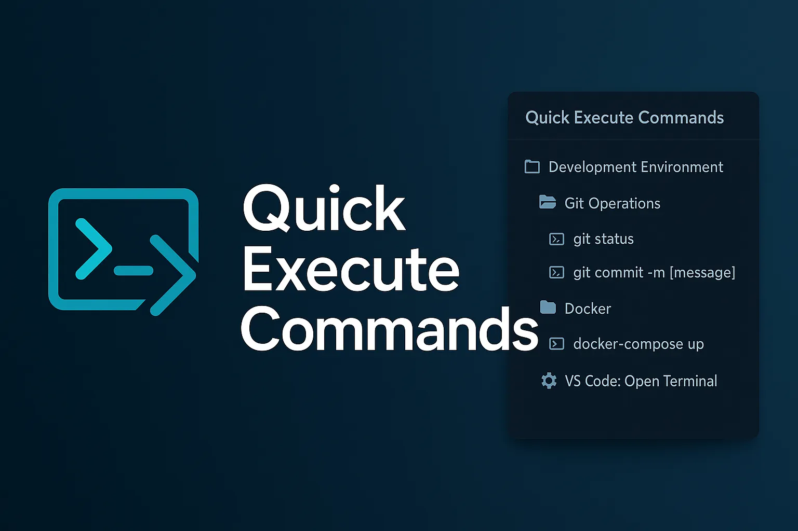

# Quick Execute Commands



[](https://marketplace.visualstudio.com/items?itemName=ren-mntn.quick-exec-commands)
[](https://marketplace.visualstudio.com/items?itemName=ren-mntn.quick-exec-commands)
[](https://marketplace.visualstudio.com/items?itemName=ren-mntn.quick-exec-commands)

> [📖 日本語版はこちら / Japanese Version](./README.ja.md)

## 🚀 **ショートカットキーの悩み、もう終わり！**

**たった 1 つのショートカット** `Ctrl+Alt+Q` だけ覚えれば、あなたのすべてのコマンドにアクセス可能！

---

## ✨ **3 つの魅力で作業効率が劇的 UP**

### 🗂️ **1. ネスト構造で整理整頓**

```
📁 開発環境
  ├── 📁 Git操作
  │   ├── 🖥️ git status
  │   └── 🖥️ git commit -m [メッセージ]
  ├── 📁 Docker
  │   └── 🖥️ docker-compose up
  └── ⚙️ VS Code: ターミナルを開く
```

**もうコマンドを探し回る必要なし！** フォルダ分けして、すっきり管理

---

### ⚡ **2. ターミナル + VS Code、両方対応**

| **ターミナルコマンド** | **VS Code コマンド** |
| ---------------------- | -------------------- |
| `npm start`            | ファイル保存         |
| `git push`             | サイドバー切り替え   |
| `docker build`         | コマンドパレット表示 |

**1 つの拡張機能で、すべて完結！**

---

### 🎯 **3. 動的入力で柔軟性抜群**


_↑ コマンドに `[変数名]` を入れると、実行時に入力フォームが表示！_

```bash
git commit -m "[コミットメッセージ]"
docker run --name [コンテナ名] [イメージ名]
```

**決まりきったコマンドも、カスタマイズ可能なコマンドも、これ 1 つで！**

---

## 📱 **直感的な 2 つのインターフェース**

### **🌟 メインパネル（サイドバー）**


_整理されたコマンド一覧で、マウスクリックで実行_

### **⚡ クイックアクセス（ショートカット）**


_`Ctrl+Alt+Q` でコマンドパレット風に即アクセス_

---

## 🎊 **こんな人におすすめ！**

- ✅ **「あのコマンド何だっけ？」** が口癖の人
- ✅ **ショートカットキーが覚えられない** 人
- ✅ **プロジェクトごとにコマンドが違って** 混乱する人
- ✅ **作業を効率化したい** すべての開発者

---

## 🚀 **5 分で使い始められる！**

### 📥 **簡単インストール**

**方法 1: VS Code 内でインストール**

1. `Ctrl+Alt+Q` で拡張機能パネルを開く
2. "Quick Execute Commands" で検索
3. 「インストール」をクリック

**方法 2: Marketplace からインストール**
[](https://marketplace.visualstudio.com/items?itemName=ren-mntn.quick-exec-commands)

### ⚡ **クイックスタート**

1. **起動** → `Ctrl+Alt+Q` でコマンド一覧表示
2. **登録** → 「➕ コマンド追加」でよく使うコマンドを追加
3. **実行** → コマンドを選択するだけ！

**今すぐ試して、作業効率の劇的変化を体験してください！**

---

# 詳細機能

A VS Code extension for efficiently managing and executing both **terminal commands** and **VS Code internal commands** with a unified interface.

## 🌟 Key Features

- **🖥️ Terminal Commands**: npm, git, docker and other shell commands
- **⚙️ VS Code Commands**: File operations, settings, extensions and other internal VS Code actions
- **🎯 Intelligent Registration**: Optimized UI based on command type
- **📁 Hierarchical Management**: Organize commands with directory structure
- **🔍 Advanced Search**: Flexible search by name, description, and tags
- **📊 Execution History**: Track command usage frequency and history
- **🌍 Multi-language Support**: Auto-detection of user locale (English/Japanese)

## 🚀 Latest Features

### VS Code Command Support

- **Available Commands**: Select from a comprehensive list of VS Code commands
- **Popular Commands**: Priority display of frequently used commands (⭐ marked)
- **Real-time Search**: Quick access with instant filtering
- **Localized Display Names**: Automatic suggestions in your language

### Enhanced Command Registration UX

- **2-Step Process**: Intuitive workflow for command creation
- **Pre-selection of Command Type**: Choose between terminal and VS Code commands
- **Searchable VS Code Commands**: Browse and filter available commands
- **Shell History Integration**: Register commands from your terminal history

### Command Editing

- **Complete Editing**: Modify all command properties
- **Multiple Access Points**: Edit from both TreeView and Webview
- **Type Preservation**: Command type cannot be changed during editing (by design)

## 📋 Getting Started

### Basic Usage

1. **Command Palette**: Run `Quick Execute Commands: Show Panel`
2. **Sidebar**: Use the Quick Execute Commands panel
3. **Keyboard Shortcuts**:
   - `Ctrl+Shift+X` (Windows/Linux) or `Ctrl+Alt+Q` (Mac) - Show command list
   - `Ctrl+Shift+F` (Windows/Linux) or `Cmd+Shift+F` (Mac) - Search commands

### Adding Commands

#### 🖥️ Adding Terminal Commands

```
1. Click "Add Command"
2. Select "Terminal Command"
3. Enter command name (e.g., "Git Status")
4. Enter command (e.g., "git status")
5. Set description, scope, and favorites
```

**Option: Use Shell History**

- Click "📋 Select from History" button
- Choose from your recent terminal commands
- Frequently used commands are marked with ⭐

#### ⚙️ Adding VS Code Commands

```
1. Click "Add Command"
2. Select "VS Code Command"
3. Search and select from command list
   - Popular commands (⭐) shown first
   - Use search box to filter
4. Enter display name and description (auto-suggested)
5. Set scope and favorites
```

### Popular VS Code Commands

| Command                                    | Display Name    | Purpose                 |
| ------------------------------------------ | --------------- | ----------------------- |
| `workbench.action.files.save`              | Save File       | Save current file       |
| `workbench.action.files.saveAll`           | Save All Files  | Save all open files     |
| `workbench.action.quickOpen`               | Quick Open      | Open file search dialog |
| `workbench.action.showCommands`            | Command Palette | Show command palette    |
| `workbench.action.toggleSidebarVisibility` | Toggle Sidebar  | Show/hide sidebar       |
| `editor.action.formatDocument`             | Format Document | Format current document |
| `workbench.action.reloadWindow`            | Reload Window   | Reload VS Code window   |

### Hierarchical Navigation

When using keyboard shortcuts, you'll get hierarchical navigation:

```
1. Category Selection
   ⭐ Favorites
   🌐 Global
   📁 Workspace

2. Directory & Command Selection
   📂 .. (Back)
   📁 aws/
   📁 docker/
   🖥️ Git Commit
   ⚙️ Save File [VS Code]

3. Subdirectory Navigation
   📂 .. (Back)
   📁 ec2/
   📁 s3/
   🖥️ AWS CLI Setup
```

### Directory Management

```
📁 workspace
  ├── 📁 development
  │   ├── 🖥️ npm start
  │   ├── 🖥️ npm test
  │   └── ⚙️ Open Terminal [VS Code]
  ├── 📁 git
  │   ├── 🖥️ git status
  │   ├── 🖥️ git commit -m [message]
  │   └── ⚙️ Show Source Control [VS Code]
  └── 📁 docker
      ├── 🖥️ docker build -t myapp .
      └── 🖥️ docker run --rm myapp

📁 global
  ├── 📁 vscode-commands
  │   ├── ⚙️ Open Settings [VS Code]
  │   ├── ⚙️ Show Extensions [VS Code]
  │   └── ⚙️ Command Palette [VS Code]
  └── 📁 system
      ├── 🖥️ node --version
      └── 🖥️ npm --version
```

### Dynamic Input Fields

Include `[variable_name]` in commands to show input forms during execution:

```bash
# Terminal command examples
git commit -m "[commit message]"
docker run --name [container_name] [image_name]
npm install [package_name]

# VS Code commands handle arguments automatically
```

## 🎮 Interface

### TreeView Operations

- **➕ Icon**: Add new command
- **📁 Icon**: Add new directory
- **🔍 Icon**: Search commands
- **⭐ Icon**: Toggle favorites
- **✏️ Icon**: Edit command
- **🗑️ Icon**: Delete command
- **Right-click**: Context menu for detailed operations

### Webview Operations

- **Command Cards**: Click to execute
- **⭐ Button**: Toggle favorites
- **▶️ Button**: Execute command
- **✏️ Button**: Edit command
- **🗑️ Button**: Delete command

## 🔧 Advanced Features

### Search Function

```
1. Command Palette → "Quick Execute Commands: Search Commands"
2. Enter keywords (searches name, description, tags)
3. Select command to execute from results
```

### Export/Import

```
Export:
1. Right-click category → "Export Commands"
2. Choose save location

Import:
1. Right-click category → "Import Commands"
2. Select JSON file
```

### Execution History

```
1. Command Palette → "Quick Execute Commands: Show Execution History"
2. Re-execute from past history (max 100 entries)
```

## 📊 Available Commands

| Command                                    | Description            | Shortcut       |
| ------------------------------------------ | ---------------------- | -------------- |
| `quick-exec-commands.showPanel`            | Show Panel             | -              |
| `quick-exec-commands.showCommandList`      | Show Command List      | `Ctrl+Shift+X` |
| `quick-exec-commands.searchCommands`       | Search Commands        | `Ctrl+Shift+F` |
| `quick-exec-commands.addCommand`           | Add Command            | -              |
| `quick-exec-commands.editCommand`          | Edit Command           | -              |
| `quick-exec-commands.addDirectory`         | Add Directory          | -              |
| `quick-exec-commands.showHistory`          | Show Execution History | -              |
| `quick-exec-commands.exportCommands`       | Export Commands        | -              |
| `quick-exec-commands.importCommands`       | Import Commands        | -              |
| `quick-exec-commands.createSampleCommands` | Create Sample Commands | -              |

## ⚙️ Data Storage

- **Global Commands**: Stored in VS Code global settings
- **Workspace Commands**: Stored in each workspace settings
- **Execution History**: Stored in global settings (max 100 entries)
- **Directory Structure**: Stored in same scope as commands

## 🛠️ Development

### Requirements

- Node.js 16+
- npm

### Setup

```bash
# Install dependencies
npm install

# Build
npm run build

# Run tests
npm test

# Development mode (watch files)
npm run dev
```

### Testing

```bash
# Run all tests
npm test

# Integration tests
npm test -- --testNamePattern="integration"
```

## 📝 Changelog

### v0.0.4 (2024-XX-XX) - 🎯 VS Code Command Support

- ✨ **VS Code Command Support**: Execute internal VS Code commands
- ✨ **Enhanced Registration UX**: 2-step intuitive workflow
- ✨ **VS Code Command List**: Search and select from available commands
- ✨ **Command Editing**: Complete editing of existing commands
- ✨ **Popular Commands**: Priority display of frequently used commands
- ✨ **Localized Display Names**: Automatic localization of VS Code commands
- ✨ **Shell History Integration**: Register commands from terminal history
- 🎨 **UI Improvements**: Command type badges and better organization
- 🔧 **Argument Support**: Automatic parsing of VS Code command arguments
- 🌍 **Multi-language Support**: English and Japanese localization

### v0.0.3 (2024-XX-XX) - 📁 Directory Management

- ✨ Directory management functionality
- ✨ Search functionality
- ✨ Execution history
- ✨ Export/Import functionality
- ✨ Tag functionality
- 🎨 TreeView UI improvements
- 📝 Comprehensive integration tests

### v0.0.2 (2024-XX-XX)

- 🐛 TreeView favorites functionality bug fixes
- 🐛 Command execution argument processing improvements
- ✅ Integration test additions

### v0.0.1 (2024-XX-XX)

- 🎉 Initial release
- ✨ Basic command management functionality
- ✨ Favorites functionality
- ✨ Dynamic input forms

## 🆘 Troubleshooting

### Panel Not Showing

1. **Check ViewContainer**

   - Look for **terminal icon** in sidebar activity bar
   - Click this icon to open "Quick Execute Commands" panel

2. **Reload Extension**

   ```
   Command Palette → "Developer: Reload Window"
   ```

3. **Create Sample Data**
   ```
   Command Palette → "Quick Execute Commands: Create Sample Commands"
   ```

### Common Issues

1. **VS Code Commands Not Executing**

   - Verify command type is set to "VS Code"
   - Check command name is exact (case-sensitive)

2. **Terminal Commands Not Working**

   - Verify command type is set to "Terminal"
   - Check if terminal is available

3. **Empty Command List**
   - Run sample command creation
   - Check debug info: `Command Palette → "Quick Execute Commands: Debug TreeView"`

## 🤝 Contributing

Pull requests and issue reports are welcome!

1. Fork the repository
2. Create your feature branch (`git checkout -b feature/AmazingFeature`)
3. Commit your changes (`git commit -m 'Add some AmazingFeature'`)
4. Push to the branch (`git push origin feature/AmazingFeature`)
5. Open a Pull Request

## 📄 License

MIT License - see the [LICENSE](LICENSE) file for details.

## 🙏 Support

If you have problems or questions, please let us know on the GitHub [Issues](https://github.com/your-repo/quick-command/issues) page.

---

**Quick Execute Commands** - Make your VS Code command execution more efficient! 🚀
